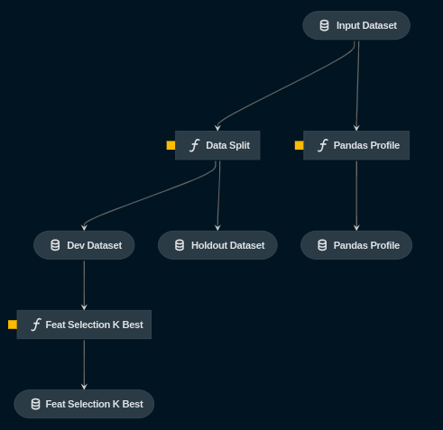

# Press Start

<p align="center">
    
</p>

## Overview

Press Start aims at providing a starting point for Data Science projects, by
running initial tests and preliminary experiments to generate insights
regarding the problem.

## How to use

Press Start uses Kedro as central framework, which allows us to execute the
steps in the project selectively.

In order to use `press-start` for your own project, clone this repository:

```bash
git@github.com:luizvbo/press-start.git
```

And change the file `conf/base/catalog.yml` to point to your data file.

## Current pipeline



## Development

This project is in constant development. Keep track of the changes and feel free to contribute.
